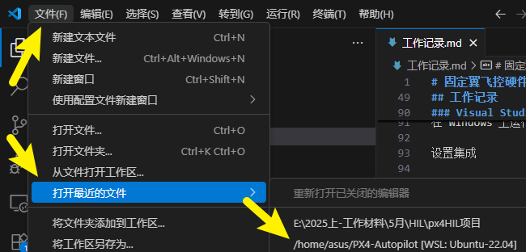
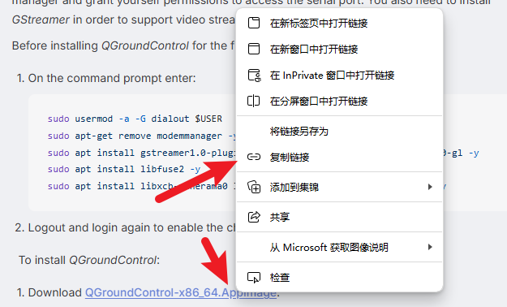
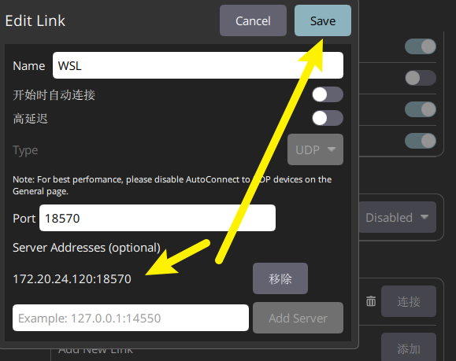
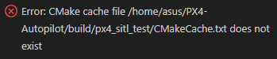
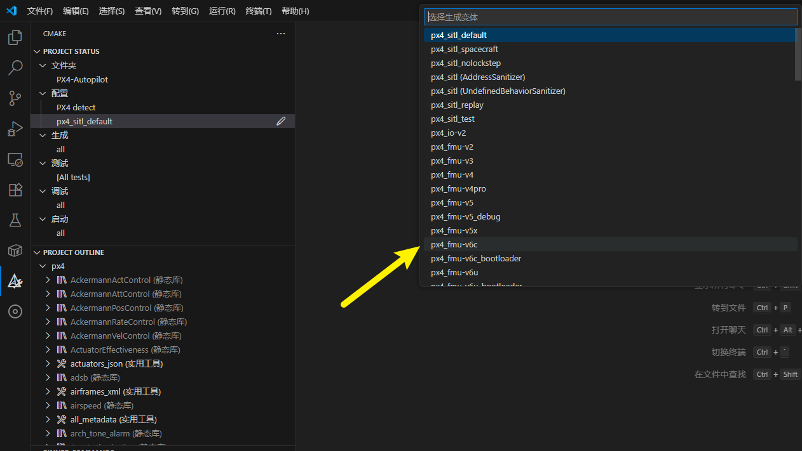
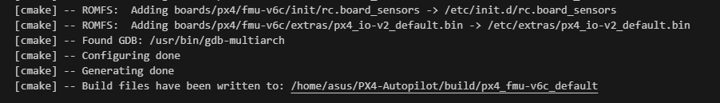
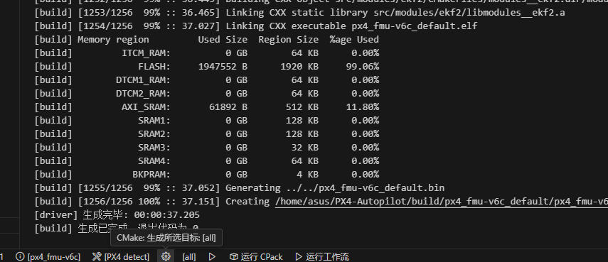
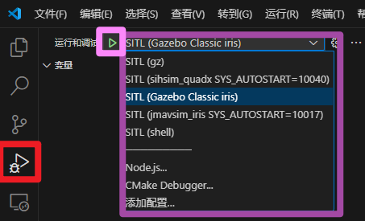
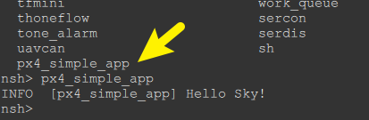
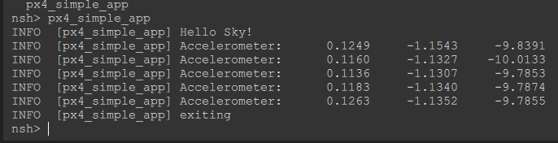

# PX4学习记录之入门指南

## 安装wsl2，配置px4环境

安装wls2使用参考该视频：https://www.bilibili.com/video/BV1tW42197za

安装Ubuntu 22.04

进入根目录，安装PX4

    git clone https://github.com/PX4/PX4-Autopilot.git --recursive

等待安装完毕。

源代码中的环境设置脚本通常适用于最近发布的 PX4 版本。如果使用的是旧版本的 PX4，可能需要获取与您的版本相匹配的[源代码](https://docs.px4.io/main/zh/contribute/git_examples.html#get-a-specific-release)。

运行 ubuntu.sh 安装程序脚本，并确认脚本运行过程中的任何提示：

    bash ./PX4-Autopilot/Tools/setup/ubuntu.sh

安装用于为 Pixhawk 和 Gazebo 或 Gazebo Classic 目标构建 PX4 的工具：
- 您可以使用--no-nuttx和--no-sim-tools选项省略NuttX和/或仿真工具。
- 其他 Linux 构建目标尚未经过测试（您可以在 Ubuntu 开发环境的 WSL shell 中输入相应命令进行尝试）。

脚本完成后，重新启动 "WSL 计算机"（退出 shell、关闭 WSL 并重新启动 WSL）：
```
exit
wsl --shutdown
wsl
```
切换到 WSL 主文件夹中的 PX4 资源库：
```
cd ~/PX4-Autopilot
```
构建 PX4 SITL 目标并测试环境：
```
make px4_sitl
```

## Visual Studio Code 集成
在 Windows 上运行的 VS Code 与 WSL 集成得很好。

设置集成

1.在 Windows 上下载并安装 Visual Studio Code (VS Code)、

2.打开 VS Code。

3.安装名为 Remote - WSL 的扩展（市场）

4.打开 WSL shell

5.在 WSL Shell中，切换到 PX4 文件夹：

    cd ~/PX4-Autopilot
6.在 WSL Shell中，启动 VS Code：
    code .

这将打开与 WSL shell 完全集成的集成开发环境。

请确保始终在远程 WSL 模式下打开 PX4 软件源。

下次要开发 WSL2 时，只需在远程 WSL 模式下选择 "最近打开"（如下图所示），就能非常轻松地再次打开它。这将为您启动 WSL。

 

 但请注意，WSL 虚拟机的 IP 地址将已更改，因此将无法从 QGC for Windows 监控模拟（仍然可以使用 QGC for Linux 进行监控）

## QGroundControl

您可以在 WSL 或 Windows 中运行 QGroundControl 来连接正在运行的模拟。如果您需要用新固件更新飞行控制板，则只能在 Windows 版 QGroundControl 中进行操作。

### WSL 上的 QGroundControl
设置和使用 QGroundControl 的最简单方法是将 Linux 版本下载到 WSL 中。

您可以在 WSL shell 中进行下载。

在网页浏览器中，导航至 QGC Ubuntu [下载部分](https://docs.qgroundcontrol.com/master/en/qgc-user-guide/getting_started/download_and_install.html#ubuntu)

右键单击 QGroundControl.AppImage 链接，然后选择 "复制链接地址"。
 
会获得类似这样的连接
https://d176tv9ibo4jno.cloudfront.net/latest/QGroundControl-x86_64.AppImage

打开 WSL shell 并输入以下命令以下载 AppImage 并使其可执行（在指定位置替换 AppImage URL）：

```
cd ~
wget <the_copied_AppImage_URL>
chmod +x QGroundControl-x86_64.AppImage 
```
运行 QGroundControl：

    ./QGroundControl.AppImage

QGroundControl 将启动并自动连接到正在运行的模拟，让您可以监控载具。

由于 WSL 不允许访问串行设备，因此无法用它来安装 PX4 固件。

### Windows 上的 QGroundControl

如果希望使用 PX4 中创建的固件更新硬件，请在 Windows 上安装 QGroundControl。

这些步骤描述了如何连接 WSL 中运行的模拟：
1. 打开 WSL shell
2. 运行``` ip addr | grep eth0 ```命令检查 WSL 虚拟机的 IP 地址：
```
ip addr | grep eth0

2: eth0: <BROADCAST,MULTICAST,UP,LOWER_UP> mtu 1500 qdisc mq state UP group default qlen 1000                               
inet 172.20.24.120/20 brd 172.20.31.255 scope global eth0 
```
将 `eth0` 接口 `inet` 地址的第一部分复制到剪贴板。本例中为`172.20.24.120`

3. 在 QGC 中，转到 Q > 应用程序设置(Application Settings ) > 通信链接( Comm Links)

4. 在上面复制的 IP 地址的 `18570` 端口添加名为 "WSL "的 UDP 链接。

5. 保存并连接。

`每次重新启动 WSL 时，您都必须更新 QGC 中的 WSL 通信链接（因为它获得的是动态 IP 地址）。`

 

## 刷写飞控板

必须使用 Windows 版 QGroundControl 对定制的 PX4 二进制程序进行烧录。

WSL2 本身**不提供**直接访问串行/USB 设备的功能，如连接到计算机的 Pixhawk 飞行控制器。这意味着您无法将在 WSL2 中运行的 QGC 连接到飞行控制器来安装固件，也无法在固件生成后使用上传命令上传固件。相反，您需要将 Windows 版 QGroundControl 连接到 WSL2 中运行的 PX4 和飞行控制器，以便上传固件。

执行以下步骤烧录在 WSL 中创建的自定义二进制文件：

1. 如果您还没有在 WSL 中构建二进制文件，例如通过 WSL shell 和运行
```
cd ~/PX4-Autopilot
make px4_fmu-v5
```
2. 如果计算机连接了 Pixhawk 板的 USB 线，请将其从计算机上拔出。
3. 打开 **Windows** 上的 QGC 并导航到 Q > 载具设置(Vehicle Setup) > 固件(Firmware)
4. 通过 USB 插入 Pixhawk 板
5. 连接后选择 "PX4 Flight Stack"，勾选高级设置，然后从下拉菜单中选择 "自定义固件文件..."。
6. 继续并选择刚刚在 WSL 中创建的固件二进制文件。

在打开的对话框中，查找左侧窗格中带有企鹅图标的 "Linux "位置。它通常都在底部。
在路径中选择文件：`Ubuntu\home\{your WSL user name}\PX4-Autopilot\build\{your build target}\{your build target}.px4`

7. 开始烧录

更多信息，请参阅[安装 PX4 主固件、测试版固件或定制固件（加载固件）](https://docs.px4.io/main/zh/config/firmware.html#installing-px4-main-beta-or-custom-firmware)。

## 故障处理
如果在安装过程中遇到任何问题，请查看当前的 Microsoft WSL 安装文档。
我们还建议您安装最新的 Windows GPU 驱动程序，并在 Ubuntu 环境中安装最新版本的 kisak mesa，以便模拟大多数 OpenGL 功能：
```
sudo add-apt-repository ppa:kisak/kisak-mesa
sudo apt update
sudo apt upgrade
```

## 设置VS Code并进行开发

安装PX4所推荐的插件

- 如果提示安装新版本的 cmake：
  - 选择 "否"（PX4 开发环境已安装正确的版本）。
- 如果提示登录 github.com，请添加您的证书：
  - 这取决于你！它提供了 Github 和集成开发环境之间的深度集成，可以简化你的工作流程。
- 其他提示是可选的，如果有用，也可以安装。

## <a id="Build_PX4"></a>编译与构建 PX4 固件
编译之前：
1. 选择构建目标（"cmake build config"）：
- 当前 cmake 的构建目标显示在底部的蓝色配置栏中（如果这已经是你想要的目标，请跳至下一步）。
  出现如图报错请按照以下方式解决。
   
    检查CMake是否在本机VS Code上安装，安装后点击左侧栏CMake图标，使用`px4-detect`工具包编译，后即可选择需要编译的固件版本。
    
- 单击配置栏上的目标以显示其他选项，然后选择您想要的选项（这将替换任何已选目标）。
- 然后，Cmake 会对项目进行配置（见右下角的通知）。
- 等待配置完成。完成后，通知将消失，您将看到构建位置：
  
2. 然后，您就可以从配置栏（选择 "构建 "或 "调试"）启动构建。
     

至少构建一次后，您就可以使用 [code completion](#code completion) 和其他 VSCode 功能了。

## 调试 

### SITL 调试

在 SITL 上调试 PX4：

1. 选择侧边栏上的调试图标（红色标记），显示调试面板。
2. 然后从顶栏调试下拉菜单（紫色方框）中选择调试目标（如调试 SITL (Gazebo Iris)）。
3. 单击调试 "播放 "箭头（顶部栏调试目标旁--粉色方框）开始调试。
在调试过程中，你可以设置断点、跳过代码，也可以像正常一样进行开发。
 

### 硬件调试

[SWD 调试端口](https://docs.px4.io/main/zh/debug/swd_debug.html)中的说明解释了如何连接到常见飞行控制器上的 SWD 接口（例如，使用 Dronecode 或 Blackmagic 探头）。

连接到 SWD 接口后，VSCode 中的硬件调试与 SITL 调试相同，只是要选择适合调试器类型（和固件）的调试目标，例如 jlink (px4_fmu-v6c)。

## 代码补全

要使代码自动完成（以及其他 IntelliSense 功能）正常工作，您需要激活配置并[构建代码](#Build_PX4)。
输入完成后，您无需再做其他任何操作；工具链会在您输入时自动为您提供符号。


## 搭建你的第一个应用

为简单起见，省略了更多高级功能，如启动/停止功能和命令行参数。这些内容将在应用程序/模块模板中介绍。

### 系统必备组件
以下内容是您需要提前准备的：

- PX4 SITL Simulator or a PX4-compatible flight controller.
- PX4 Development Toolchain for the desired target.
- Download the PX4 Source Code from Github


源代码 PX4-Autopilot/src/examples/px4_simple_app 目录包含本教程的完整版本，遇到问题时可以查看。

- 重命名（或删除）px4_simple_app 目录。

### 最小的应用程序

在本节中，我们将创建一个只打印 Hello Sky!它由一个 C 语言文件和一个 cmake 定义（告诉工具链如何构建应用程序）组成。

1. 创建新目录 PX4-Autopilot/src/examples/px4_simple_app。
2. 在该目录下新建一个 C 语言文件，命名为 px4_simple_app.c
   将默认标题复制到页面顶部。该注释应出现在所有贡献的文件中！
```
/****************************************************************************
 *
 *   Copyright (c) 2012-2022 PX4 Development Team. All rights reserved.
 *
 * Redistribution and use in source and binary forms, with or without
 * modification, are permitted provided that the following conditions
 * are met:
 *
 * 1. Redistributions of source code must retain the above copyright
 *    notice, this list of conditions and the following disclaimer.
 * 2. Redistributions in binary form must reproduce the above copyright
 *    notice, this list of conditions and the following disclaimer in
 *    the documentation and/or other materials provided with the
 *    distribution.
 * 3. Neither the name PX4 nor the names of its contributors may be
 *    used to endorse or promote products derived from this software
 *    without specific prior written permission.
 *
 * THIS SOFTWARE IS PROVIDED BY THE COPYRIGHT HOLDERS AND CONTRIBUTORS
 * "AS IS" AND ANY EXPRESS OR IMPLIED WARRANTIES, INCLUDING, BUT NOT
 * LIMITED TO, THE IMPLIED WARRANTIES OF MERCHANTABILITY AND FITNESS
 * FOR A PARTICULAR PURPOSE ARE DISCLAIMED. IN NO EVENT SHALL THE
 * COPYRIGHT OWNER OR CONTRIBUTORS BE LIABLE FOR ANY DIRECT, INDIRECT,
 * INCIDENTAL, SPECIAL, EXEMPLARY, OR CONSEQUENTIAL DAMAGES (INCLUDING,
 * BUT NOT LIMITED TO, PROCUREMENT OF SUBSTITUTE GOODS OR SERVICES; LOSS
 * OF USE, DATA, OR PROFITS; OR BUSINESS INTERRUPTION) HOWEVER CAUSED
 * AND ON ANY THEORY OF LIABILITY, WHETHER IN CONTRACT, STRICT
 * LIABILITY, OR TORT (INCLUDING NEGLIGENCE OR OTHERWISE) ARISING IN
 * ANY WAY OUT OF THE USE OF THIS SOFTWARE, EVEN IF ADVISED OF THE
 * POSSIBILITY OF SUCH DAMAGE.
 *
 ****************************************************************************/
```
将下面的代码复制到头部注释的下方， 该注释应出现在所有贡献的文件中！
```
/**
 * @file px4_simple_app.c
 * Minimal application example for PX4 autopilot
 *
 * @author Example User <mail@example.com>
 */

#include <px4_platform_common/log.h>

__EXPORT int px4_simple_app_main(int argc, char *argv[]);

int px4_simple_app_main(int argc, char *argv[])
{
    PX4_INFO("Hello Sky!");
    return OK;
}
```
`main` 函数必须命名为 `<module_name>_main` 并从模块中导出，如上所示。

`PX4_INFO` 相当于 PX4 shell 的 `printf`（包含在 **px4_platform_common/log.h** 中）。有不同的日志级别：`px4_info`、`px4_warn`、`px4_err`、`px4_debug`。警告和错误会额外添加到 ULog 中，并显示在 Flight Review 上。

3. 创建并打开一个新的 cmake 定义文件，文件名为 CMakeLists.txt。复制下面的文本：
```
############################################################################
#
#   Copyright (c) 2015 PX4 Development Team. All rights reserved.
#
# Redistribution and use in source and binary forms, with or without
# modification, are permitted provided that the following conditions
# are met:
#
# 1. Redistributions of source code must retain the above copyright
#    notice, this list of conditions and the following disclaimer.
# 2. Redistributions in binary form must reproduce the above copyright
#    notice, this list of conditions and the following disclaimer in
#    the documentation and/or other materials provided with the
#    distribution.
# 3. Neither the name PX4 nor the names of its contributors may be
#    used to endorse or promote products derived from this software
#    without specific prior written permission.
#
# THIS SOFTWARE IS PROVIDED BY THE COPYRIGHT HOLDERS AND CONTRIBUTORS
# "AS IS" AND ANY EXPRESS OR IMPLIED WARRANTIES, INCLUDING, BUT NOT
# LIMITED TO, THE IMPLIED WARRANTIES OF MERCHANTABILITY AND FITNESS
# FOR A PARTICULAR PURPOSE ARE DISCLAIMED. IN NO EVENT SHALL THE
# COPYRIGHT OWNER OR CONTRIBUTORS BE LIABLE FOR ANY DIRECT, INDIRECT,
# INCIDENTAL, SPECIAL, EXEMPLARY, OR CONSEQUENTIAL DAMAGES (INCLUDING,
# BUT NOT LIMITED TO, PROCUREMENT OF SUBSTITUTE GOODS OR SERVICES; LOSS
# OF USE, DATA, OR PROFITS; OR BUSINESS INTERRUPTION) HOWEVER CAUSED
# AND ON ANY THEORY OF LIABILITY, WHETHER IN CONTRACT, STRICT
# LIABILITY, OR TORT (INCLUDING NEGLIGENCE OR OTHERWISE) ARISING IN
# ANY WAY OUT OF THE USE OF THIS SOFTWARE, EVEN IF ADVISED OF THE
# POSSIBILITY OF SUCH DAMAGE.
#
############################################################################
px4_add_module(
    MODULE examples__px4_simple_app
    MAIN px4_simple_app
    STACK_MAIN 2000
    SRCS
        px4_simple_app.c
    DEPENDS
    )
```
`px4_add_module()` 方法会根据模块描述构建静态库。
- `MODULE` 块是模块的固件唯一名称（按照惯例，模块名称以父目录为前缀，回到 `src`）。
- `MAIN` 块列出了模块的入口点，它将命令注册到 `NuttX` 中，以便从 `PX4 shell` 或 `SITL` 控制台调用。

`px4_add_module()` 的格式在 `PX4-Autopilot/cmake/px4_add_module.cmake` 中有详细说明。

如果在 `px4_add_module` 的选项中指定 `DYNAMIC`，则会创建一个共享库，而不是 POSIX 平台上的静态库（这些库无需重新编译 PX4 即可加载，并以二进制文件而非源代码的形式共享给他人）。您的应用程序不会成为内置命令，而是会被单独存放在名为 `examples__px4_simple_app.px4mod` 的文件中。然后，你可以在运行时使用 `dyn` 命令加载该文件来运行你的命令：`dyn ./examples__px4_simple_app.px4mod`

4. 创建并打开名为 `Kconfig` 的新 `Kconfig` 定义文件，并定义命名符号（请参阅 `Kconfig` 命名约定）。复制下面的文本：
```
menuconfig EXAMPLES_PX4_SIMPLE_APP
    bool "px4_simple_app"
    default n
    ---help---
        Enable support for px4_simple_app
```

### 编译应用程序/固件
应用程序的编写至此完成。 为了运行它，您首先需要确保它是作为 PX4 的一部分构建的。

应用程序会被添加到目标机的相应板级 `px4board` 文件中的构建/固件中：

要将应用程序编译到固件中，请在 `px4board` 文件中添加相应的 `Kconfig` 密钥 `CONFIG_EXAMPLES_PX4_SIMPLE_APPP=y`，或运行 `boardconfig make px4_fmu-v4_default boardconfig`

由于默认情况下固件中包含示例，因此大多数文件中都会有这一行。

找到`/boards/px4/fmu-v6c/default.px4board`在最后一行下增加`CONFIG_EXAMPLES_PX4_SIMPLE_APPP=y`，保存并编译。

打开**Windows的QGC**，将刚刚生成的px4文件烧录进去。
重启后进入`Q/Analyze Tools/Mavlink 控制台`，输入`help`
可以看到我们新写的app以及存在于飞控机内部，我们运行它，得到期望结果。


该应用程序现在已正确注册到系统中，并且可以扩展以实际执行实用的任务。

### 订阅传感器数据
为了做一些实用的事情，应用程序需要订阅输入和发布输出（例如电机或舵机命令）。

应用程序之间的单个信息通道称为**主题(Topic)**。在本教程中，我们关注的是 SensorCombined 主题，它保存着整个系统的同步传感器数据。

订阅主题很简单：
```
#include <uORB/topics/sensor_combined.h>
..
int sensor_sub_fd = orb_subscribe(ORB_ID(sensor_combined));
```
`sensor_sub_fd` 是一个主题句柄，可用于非常高效地对新数据执行阻塞等待。当前线程进入休眠状态，一旦有新数据可用就会被调度器自动唤醒，等待时不消耗任何 CPU 周期。为此，我们使用了 `poll()` POSIX 系统调用。
在订阅中添加 poll() 看起来就像这样（伪代码，完整实现见下文）：
```
#include <poll.h>
#include <uORB/topics/sensor_combined.h>
..
int sensor_sub_fd = orb_subscribe(ORB_ID(sensor_combined));

/* one could wait for multiple topics with this technique, just using one here */
px4_pollfd_struct_t fds[] = {
    { .fd = sensor_sub_fd,   .events = POLLIN },
};

while (true) {
    /* wait for sensor update of 1 file descriptor for 1000 ms (1 second) */
    int poll_ret = px4_poll(fds, 1, 1000);
    ..
    if (fds[0].revents & POLLIN) {
        /* obtained data for the first file descriptor */
        struct sensor_combined_s raw;
        /* copy sensors raw data into local buffer */
        orb_copy(ORB_ID(sensor_combined), sensor_sub_fd, &raw);
        PX4_INFO("Accelerometer:\t%8.4f\t%8.4f\t%8.4f",
                    (double)raw.accelerometer_m_s2[0],
                    (double)raw.accelerometer_m_s2[1],
                    (double)raw.accelerometer_m_s2[2]);
    }
}
```

再次编译应用程序可以输入：
```
make
```

### 测试 uORB 消息订阅

最后一步是通过在 nsh shell 中键入以下内容来启动您的应用程序作为后台进程/任务：
```
px4_simple_app &
```
您的应用程序将在控制台中显示 5 个传感器值（译者注：需要使用后面的完整示例中的代码，如果使用上面的伪代码会连续输出并无法退出），然后退出：
```
[px4_simple_app] Accelerometer:   0.0483          0.0821          0.0332
[px4_simple_app] Accelerometer:   0.0486          0.0820          0.0336
[px4_simple_app] Accelerometer:   0.0487          0.0819          0.0327
[px4_simple_app] Accelerometer:   0.0482          0.0818          0.0323
[px4_simple_app] Accelerometer:   0.0482          0.0827          0.0331
[px4_simple_app] Accelerometer:   0.0489          0.0804          0.0328
```
完整应用程序模块模板可用于编写可通过命令行控制的后台进程。

### 发布数据

要使用计算结果，下一步就是公布结果。下面我们将展示如何发布姿态主题。

我们之所以选择 "姿态(attitude)"，是因为我们知道 mavlink 应用程序会将其转发到地面控制站，从而提供了一种查看结果的简便方法。

界面非常简单：初始化要发布的主题的结构并发布主题：
```
#include <uORB/topics/vehicle_attitude.h>
..
/* advertise attitude topic */
struct vehicle_attitude_s att;
memset(&att, 0, sizeof(att));
orb_advert_t att_pub_fd = orb_advertise(ORB_ID(vehicle_attitude), &att);
```
在主循环中，随时发布信息：
```
orb_publish(ORB_ID(vehicle_attitude), att_pub_fd, &att);
```
### 完整的示例代码
```
/****************************************************************************
 *
 *   Copyright (c) 2012-2019 PX4 Development Team. All rights reserved.
 *
 * Redistribution and use in source and binary forms, with or without
 * modification, are permitted provided that the following conditions
 * are met:
 *
 * 1. Redistributions of source code must retain the above copyright
 *    notice, this list of conditions and the following disclaimer.
 * 2. Redistributions in binary form must reproduce the above copyright
 *    notice, this list of conditions and the following disclaimer in
 *    the documentation and/or other materials provided with the
 *    distribution.
 * 3. Neither the name PX4 nor the names of its contributors may be
 *    used to endorse or promote products derived from this software
 *    without specific prior written permission.
 *
 * THIS SOFTWARE IS PROVIDED BY THE COPYRIGHT HOLDERS AND CONTRIBUTORS
 * "AS IS" AND ANY EXPRESS OR IMPLIED WARRANTIES, INCLUDING, BUT NOT
 * LIMITED TO, THE IMPLIED WARRANTIES OF MERCHANTABILITY AND FITNESS
 * FOR A PARTICULAR PURPOSE ARE DISCLAIMED. IN NO EVENT SHALL THE
 * COPYRIGHT OWNER OR CONTRIBUTORS BE LIABLE FOR ANY DIRECT, INDIRECT,
 * INCIDENTAL, SPECIAL, EXEMPLARY, OR CONSEQUENTIAL DAMAGES (INCLUDING,
 * BUT NOT LIMITED TO, PROCUREMENT OF SUBSTITUTE GOODS OR SERVICES; LOSS
 * OF USE, DATA, OR PROFITS; OR BUSINESS INTERRUPTION) HOWEVER CAUSED
 * AND ON ANY THEORY OF LIABILITY, WHETHER IN CONTRACT, STRICT
 * LIABILITY, OR TORT (INCLUDING NEGLIGENCE OR OTHERWISE) ARISING IN
 * ANY WAY OUT OF THE USE OF THIS SOFTWARE, EVEN IF ADVISED OF THE
 * POSSIBILITY OF SUCH DAMAGE.
 *
 ****************************************************************************/

/**
 * @file px4_simple_app.c
 * Minimal application example for PX4 autopilot
 *
 * @author Example User <mail@example.com>
 */

#include <px4_platform_common/px4_config.h>
#include <px4_platform_common/tasks.h>
#include <px4_platform_common/posix.h>
#include <unistd.h>
#include <stdio.h>
#include <poll.h>
#include <string.h>
#include <math.h>

#include <uORB/uORB.h>
#include <uORB/topics/sensor_combined.h>
#include <uORB/topics/vehicle_attitude.h>

__EXPORT int px4_simple_app_main(int argc, char *argv[]);

int px4_simple_app_main(int argc, char *argv[])
{
    PX4_INFO("Hello Sky!");

    /* subscribe to sensor_combined topic */
    int sensor_sub_fd = orb_subscribe(ORB_ID(sensor_combined));
    /* limit the update rate to 5 Hz */
    orb_set_interval(sensor_sub_fd, 200);

    /* advertise attitude topic */
    struct vehicle_attitude_s att;
    memset(&att, 0, sizeof(att));
    orb_advert_t att_pub = orb_advertise(ORB_ID(vehicle_attitude), &att);

    /* one could wait for multiple topics with this technique, just using one here */
    px4_pollfd_struct_t fds[] = {
        { .fd = sensor_sub_fd,   .events = POLLIN },
        /* there could be more file descriptors here, in the form like:
         * { .fd = other_sub_fd,   .events = POLLIN },
         */
    };

    int error_counter = 0;

    for (int i = 0; i < 5; i++) {
        /* wait for sensor update of 1 file descriptor for 1000 ms (1 second) */
        int poll_ret = px4_poll(fds, 1, 1000);

        /* handle the poll result */
        if (poll_ret == 0) {
            /* this means none of our providers is giving us data */
            PX4_ERR("Got no data within a second");

        } else if (poll_ret < 0) {
            /* this is seriously bad - should be an emergency */
            if (error_counter < 10 || error_counter % 50 == 0) {
                /* use a counter to prevent flooding (and slowing us down) */
                PX4_ERR("ERROR return value from poll(): %d", poll_ret);
            }

            error_counter++;

        } else {

            if (fds[0].revents & POLLIN) {
                /* obtained data for the first file descriptor */
                struct sensor_combined_s raw;
                /* copy sensors raw data into local buffer */
                orb_copy(ORB_ID(sensor_combined), sensor_sub_fd, &raw);
                PX4_INFO("Accelerometer:\t%8.4f\t%8.4f\t%8.4f",
                     (double)raw.accelerometer_m_s2[0],
                     (double)raw.accelerometer_m_s2[1],
                     (double)raw.accelerometer_m_s2[2]);

                /* set att and publish this information for other apps
                 the following does not have any meaning, it's just an example
                */
                att.q[0] = raw.accelerometer_m_s2[0];
                att.q[1] = raw.accelerometer_m_s2[1];
                att.q[2] = raw.accelerometer_m_s2[2];

                orb_publish(ORB_ID(vehicle_attitude), att_pub, &att);
            }

            /* there could be more file descriptors here, in the form like:
             * if (fds[1..n].revents & POLLIN) {}
             */
        }
    }

    PX4_INFO("exiting");

    return 0;
}
```
按照上述步骤重新编译，运行。获得了期望效果。


## 适用于开发完整应用的模版

编写应用程序时，既可以将其作为任务（拥有自己的堆栈和进程优先级的模块）运行，也可以将其作为工作队列任务（在工作队列线程上运行的模块，与工作队列上的其他任务共享堆栈和线程优先级）运行。在大多数情况下，可以使用工作队列任务，因为这会减少资源的使用。

### 工作队列任务
PX4-Autopilot 包含一个模板，用于编写作为工作队列任务运行的新应用程序（模块）：src/examples/work_item。

工作队列任务应用程序与普通(任务)应用程序相同。 除了它需要指定它是一个工作队列任务，并在初始化期间运行调度它本身。

示例显示了如何操作。 总结：
1. 在 `cmake` 定义文件 (CMakeLists.txt) 中指定工作队列库的依赖关系：
```
...
DEPENDS
   px4_work_queue
```
2. 除了 `ModuleBase` 之外，任务还应派生自 `ScheduledWorkItem`（包含在   [ScheduledWorkItem.hpp](https://github.com/PX4/PX4-Autopilot/blob/main/platforms/common/include/px4_platform_common/px4_work_queue/ScheduledWorkItem.hpp) 中）。
3. 在构造函数初始化中指定要添加任务的队列。`work_item` 示例将自己添加到 `wq_configurations::test1` 工作队列中，如下所示：

```
WorkItemExample::WorkItemExample() :
    ModuleParams(nullptr),
    ScheduledWorkItem(MODULE_NAME, px4::wq_configurations::test1)
{
}
```

可用的工作队列（wq_configurations）在 [WorkQueueManager.hpp](https://github.com/PX4/PX4-Autopilot/blob/main/platforms/common/include/px4_platform_common/px4_work_queue/WorkQueueManager.hpp#L49) 中列出。

4. 执行 `ScheduledWorkItem::Run()` 方法来执行 "工作"。
5. 执行 `task_spawn` 方法，指定任务是一个工作队列（使用 `task_id_is_work_queue id`）。
6. 使用其中一种调度方法调度工作队列任务（在示例中，我们使用 `init` 方法中的 `ScheduleOnInterval`）。

### 任务
`PX4/PX4-Autopilot` 包含一个用于编写新应用程序（模块）的模板，该模块可作为任务运行在自己的堆栈中：`src/templates/template_module`。
该模板演示了完整应用程序所需或有用的以下附加功能/方面：
- 访问参数并对参数更新做出反应。
- 订阅、等待 topic 更新。
- 通过 start/stop/status 控制在后台运行的任务。`module start [<arguments>]`命令可直接添加到启动脚本中。
- 命令行参数解析。
- 文档：`PRINT_MODULE_*` 方法有两个用途（源代码中记录了 API）：
  - 它们用于在控制台输入`model help`时打印命令行用法。
  - 它们通过脚本自动提取以生成[模块和命令](https://docs.px4.io/main/zh/modules/modules_main.html) 参考页面。
