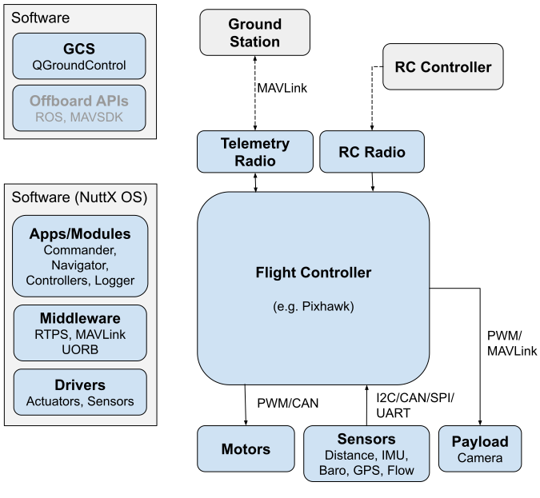
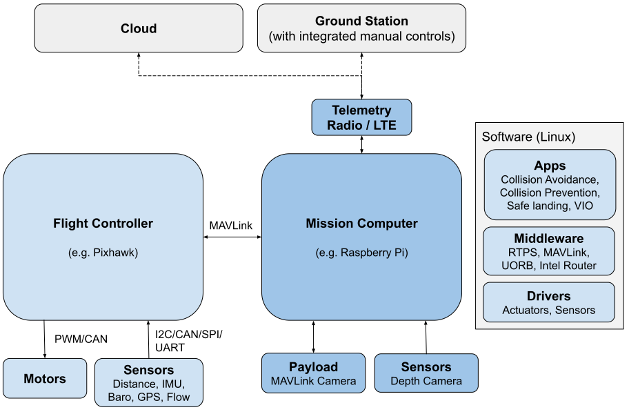
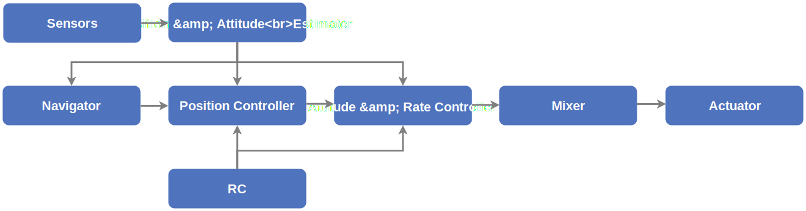
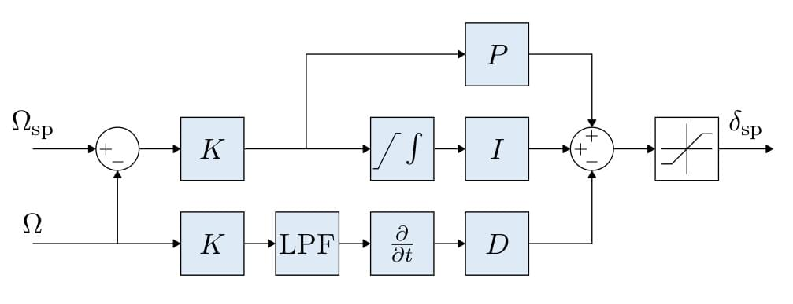
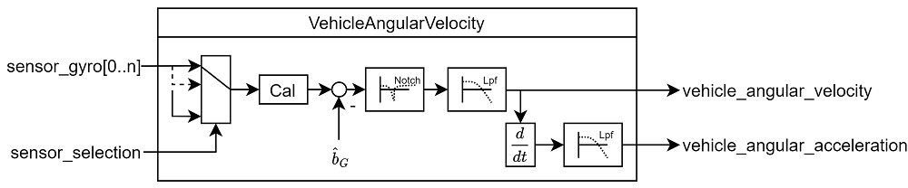
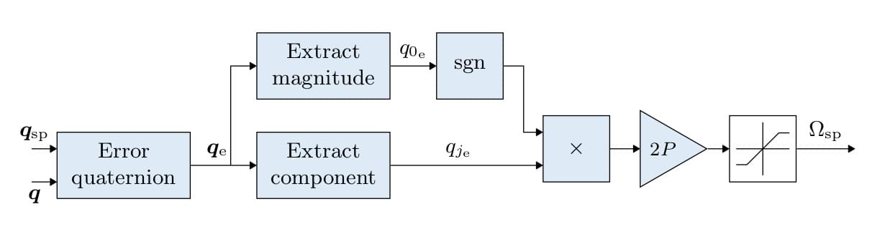
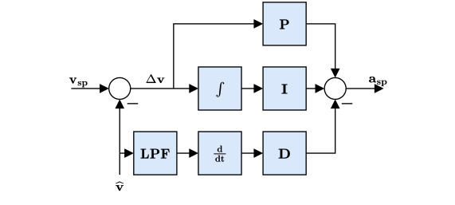
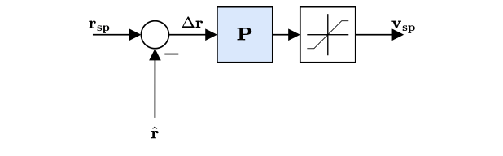
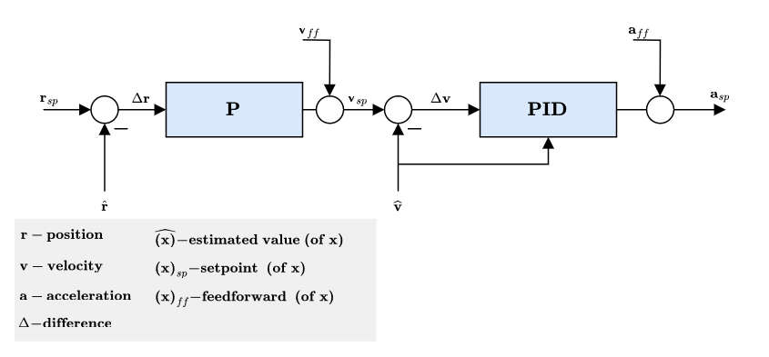

# PX4学习记录之概念

## PX4 架构
下面的章节提供了两个 "典型 "PX4 系统的 PX4 硬件和软件堆栈的高级概述：一个系统只有一个飞行控制器，另一个系统则有一个飞行控制器和一个配套计算机（也称为 "任务计算机"）。
PX4 结构概述提供了有关飞行堆栈和中间件的信息。ROS 和 MAVSDK 中涵盖了机外 API。

### 飞行控制器（仅含飞控）
下图提供了一个以飞行控制器为基础的典型 "简单" PX4 系统的高层概览。
 

硬件包括
- 飞行控制器（运行 PX4 飞行堆栈）。这通常包括内部 IMU、罗盘和气压计。
- 电机电调连接到 PWM 输出、DroneCAN（DroneCAN 允许双向通信，而不是如图所示的单向）或其他总线。
- 通过 I2C、SPI、CAN、UART 等连接的传感器（GPS、罗盘、距离传感器、气压计、光流量计、气压计、ADSB 转发器等）。
- 相机或其他有效载荷。摄像头云台可连接到 PWM 输出端或通过 MAVLink 连接。
- 用于连接地面站计算机/软件的遥测无线电。
- 用于手动控制的遥控系统
图的左侧显示的是软件堆栈，与图中的硬件部分水平对齐（大致如此）。
- 地面站计算机通常运行 `QGroundControl（或其他地面站软件）`。它还可以运行 `MAVSDK` 或 `ROS` 等机器人软件。
- 在飞行控制器上运行的 `PX4` 飞行堆栈包括驱动程序、通信模块、控制器、估算器以及其他中间件和系统模块。
### 飞控和计算机
下图显示的 `PX4` 系统包括一个飞行控制器和一个配套计算机（此处称为 "任务计算机"）。
 

 飞行控制器运行普通的 `PX4` 飞行堆栈，而配套计算机则提供利用计算机视觉的高级功能。两个系统通过快速串行或 `IP` 链路连接，通常使用 `MAVLink` 协议进行通信。与地面站和云的通信通常通过配套计算机进行（如使用 [MAVLink 路由器](https://github.com/mavlink-router/mavlink-router)（英特尔公司提供））。

 `PX4` 系统通常在配套计算机上运行 `Linux` 操作系统。`Linux` 是一个比 `NuttX` 更好的 "通用 "软件开发平台；`Linux` 开发人员更多，而且已经编写了许多有用的软件（如计算机视觉、通信、云集成、硬件驱动程序）。出于同样的原因，计算机有时也会运行安卓系统。

该图显示了通过 `LTE` 连接云或地面站的情况，许多基于 `PX4` 的系统都采用了这种方法。`PX4` 不提供专门用于 `LTE` 和/或云集成的软件（这需要定制开发）。

## PX4 系统架构概述
PX4 包括两个主要层：飞行堆栈是一个估算和飞行控制系统，中间件是一个通用机器人层，可支持任何类型的自主机器人，提供内部/外部通信和硬件集成。
所有 PX4 机身共享一个代码库（包括其他机器人系统，如船只、漫游车、潜水艇等）。整个系统的设计是被动的，这意味着:
- 所有的功能都可以被分割成若干可替换、可重复使用的部件。
- 通过异步消息传递进行通信。
- 系统可以应对不同的工作负载。

### 顶层软件架构
下面的架构图对 PX4 的各个积木模块以及各模块之间的联系进行了一个详细的概述。 图的上半部分包括了中间件模块，而下半部分展示的则是飞行控制栈的组件。

 

源代码被分割成独立的模块/程序（如图所示）。通常来说一个图中的积木块对应一个功能模块。
运行时，您可以使用 shell 中的 `top` 命令检查哪些模块被执行，还可以通过 `<module_name> start/stop` 命令单独启动/停止每个模块。`topcommand` 是 `NuttX shell` 特有的命令，其他命令也可在 `SITL shell (pxh>)` 中使用。有关这些模块的更多信息，请参阅[模块与命令参考](https://docs.px4.io/main/zh/modules/modules_main.html)。

箭头表示模块之间最重要连接的信息流。使用 发布-订阅 消息总线这个方案意味着：

模块之间通过名为 uORB 的发布-订阅消息总线进行通信。它包括了为固定翼、旋翼和 VTOL 无人机设计的控制器，以及相应的姿态、位置估计器。
- 系统是 “响应式” 的 — 系统异步运行，新数据抵达时系统立即进行更新。
- 系统所有的活动和通信都是完全并行的。
- 系统组件在任何地方都可以在保证线程安全的情况下使用数据。
这种架构允许快速、轻松地更换每一个模块，甚至在运行时也是如此。

### 飞行控制栈
飞行堆栈是自主无人机制导、导航和控制算法的集合。它包括用于固定翼、多旋翼和 VTOL 机身的控制器，以及姿态和位置估算器。
下图显示了飞行堆栈的构建模块概览。它包含从传感器、遥控输入和自主飞行控制（导航仪）到电机或伺服控制（执行器）的整个流程。

 

**估算器**接收一个或多个传感器输入，将其组合后计算出载具状态（例如，根据 IMU 传感器数据计算出车辆姿态）。
**控制器**是将设定点和测量值或估计状态（过程变量）作为输入的组件。其目标是调整过程变量的值，使其与设定点相匹配。输出是最终达到设定点的修正值。例如，位置控制器将位置设定点作为输入，过程变量是当前估计的位置，输出则是姿态和推力设定点，使飞行器向理想位置移动。
**混控器**接收力指令（如 "向右转弯"）并将其转换为单个电机指令，同时确保不超过某些限制。这种转换针对具体的车辆类型，并取决于各种因素，例如相对于重心的电机布置或车辆的转动惯量。

### 中间件

中间件主要包括用于嵌入式传感器的设备驱动程序、与外部世界（配套计算机、GCS 等）的通信以及 uORB 发布-订阅信息总线。
此外，中间件还包括一个仿真层，允许 `PX4` 飞行代码在桌面操作系统上运行，并在仿真 "世界 "中控制计算机模型飞行器。

### 更新速率

由于模块需要等待信息更新，因此通常由驱动程序定义模块的更新速度。大多数 `IMU` 驱动程序以 `1kHz` 的频率对数据进行采样，然后以 `250Hz` 的频率进行整合和发布。系统的其他部分，如导航仪，不需要这么高的更新速度，因此运行速度要慢得多。

通过运行 `uorb top`，可以在系统上实时检查报文更新率。

### 运行时的环境
PX4 可在提供 POSIX-API 的各种操作系统（如 Linux、macOS、NuttX 或 QuRT）上运行。它还应具有某种形式的实时调度功能（如先进先出）。
模块间通信（使用 uORB）基于共享内存。整个 PX4 中间件在一个地址空间内运行，即所有模块共享内存。
根据系统的设计，只需极少的努力，就可以在单独的地址空间中运行每个模块（需要更改的部分包括 uORB、参数接口、dataman 和 perf）。
模块有两种不同的执行方式：
- 任务：模块在自己的任务中运行，有自己的堆栈和进程优先级。
- 工作队列任务：模块在共享工作队列上运行，与队列上的其他模块共享相同的堆栈和工作队列线程优先级。
  - 所有任务都必须相互合作，不能相互干扰。
  - 一个队列上可以运行多个工作队列任务，也可以有多个队列。
  - 工作队列任务是通过指定未来某个固定时间或通过 uORB 主题更新回调来安排的。

在工作队列上运行模块的优点是占用内存少，可能导致任务切换次数减少。缺点是工作队列任务不能休眠或对消息进行轮询，也不能进行阻塞性 IO（如从文件中读取）。运行时间长的任务（计算量大）可能也应在单独的任务或至少是单独的工作队列中运行。

在工作队列中运行的任务不会显示在顶部（只能看到工作队列本身，例如 wq:lp_default）。使用 work_queue status 可以显示所有活动的工作队列项目。

### 后台任务
px4_task_spawn_cmd() 用于启动新任务（NuttX）或线程（POSIX - Linux/macOS），这些任务独立于调用（父）任务运行：
```
independent_task = px4_task_spawn_cmd(
    "commander",                    // Process name
    SCHED_DEFAULT,                  // Scheduling type (RR or FIFO)
    SCHED_PRIORITY_DEFAULT + 40,    // Scheduling priority
    3600,                           // Stack size of the new task or thread
    commander_thread_main,          // Task (or thread) main function
    (char * const *)&argv[0]        // Void pointer to pass to the new task
                                    // (here the commandline arguments).
    );
```

### 操作系统相关的信息

**NuttX**
NuttX 是在飞行控制板上运行 PX4 的主要 RTOS。它开源（BSD 许可）、轻量级、高效且非常稳定。

模块作为任务执行：它们有自己的文件描述符列表，但共享一个地址空间。一个任务仍然可以启动一个或多个共享文件描述符列表的线程。

每个任务/线程都有一个固定大小的堆栈，并有一个定期任务来检查所有堆栈是否有足够的剩余空间（基于堆栈着色）。

**Linux/MacOS**
在 Linux 或 macOS 上，PX4 在单个进程中运行，模块在各自的线程中运行（与 NuttX 没有任务和线程之分）。

## 控制器图解
这些图表使用标准 PX4 术语（每个图表都有注释图例）。
### 多旋翼的控制架构

 

- 这是一个标准的级联控制架构。
- 控制器采用P和PID控制的组合方式。
- 估计值来自 EKF2。
- 在某些模式下，外环(位置回路)可能会被绕过 (在图中表示为外环之后增加一个多路开关)。 只有在位置保持模式或某轴无速度请求时，位置回路才会发挥作用。

**多旋翼角速率控制器**

 

 - 采用K-PID控制器。更多信息，请参见[速率控制器](https://docs.px4.io/main/zh/config_mc/pid_tuning_guide_multicopter.html#rate-controller)。
 - 为了防止积分饱和，积分环节的权重是受限的。
 - 输出受到限制（在控制分配模块中），通常为-1 和 1。
 - 在导数路径上使用低通滤波器 （LPF） 来降低噪声（陀螺仪驱动器为控制器提供滤波导数）。
  
  IMU 流程为：陀螺仪数据 > 应用校准参数 > 消除估计偏差 > 陷波滤波器（IMU_GYRO_NF0_BW 和 IMU_GYRO_NF0_FRQ） > 低通滤波器（IMU_GYRO_CUTOFF） > 载具角速度（P 和 I 控制器使用的滤波角速度） > 导数 -> 低通滤波器（IMU_DGYRO_CUTOFF） > 载具角加速度（D 控制器使用的滤波角加速度）。
   

**多旋翼姿态控制器**



- 姿态控制器使用四元数。
- 控制器就是根据[这篇文章](https://www.research-collection.ethz.ch/bitstream/handle/20.500.11850/154099/eth-7387-01.pdf)实现的。
- 当你调整这个控制器时，唯一需要考虑的参数是增益 P。
- 输出的角速率命令是饱和的。

**多旋翼飞行器加速度到推力和姿态设定点的转换**

- 速度控制器生成的加速度设定点将转换为推力和姿态设定点。
- 转换后的加速度设定点将达到饱和，并在垂直和水平推力中优先使用。
- 推力饱和是在计算出相应推力后进行的：
  1. 计算所需的垂直推力 (thrust_z)
  2. 用 MPC_THR_MAX 使推力_z 饱和
  3. 用 (MPC_THR_MAX^2 - thrust_z^2)^0.5 填充 thrust_xy

实现细节请参见 **PositionControl.cpp** 和 **ControlMath.cpp**。

**多旋翼速度控制器**



- 采用PID控制器来稳定速度。 该控制器输出的命令是加速度。
- 积分器包括了一个采用钳制方法的反复位饱和措施。
- 指令加速度不饱和 - 将对转换后的推力设定点和最大倾斜角应用饱和度。
- 通过参数 MPC_XY_VEL_P_ACC、MPC_XY_VEL_I_ACC 和 MPC_XY_VEL_D_ACC 设置水平增益。
- 通过参数 MPC_Z_VEL_P_ACC、MPC_Z_VEL_I_ACC 和 MPC_Z_VEL_D_ACC 设置垂直增益。

**多旋翼位置控制器**



- 采用简单的P控制器来控制速度。
- 输出的速度命令是饱和的，目的是保持一定的速度限制。参见参数 MPC_XY_VEL_MAX。该参数设置可能的最大水平速度。它不同于最大期望速度 MPC_XY_CRUISE（自主模式）和 MPC_VEL_MANUAL（手动位置控制模式）。
- 通过参数 MPC_XY_P 设置水平 P 增益。
- 通过参数 MPC_Z_P 设置垂直 P 增益。

**静态力矩 (PI) 缩放补偿**


- 与模式相关的前馈（ff）--例如，任务模式轨迹生成器（颠簸限制轨迹）计算位置、速度和加速度设定点。
- 加速度设定点（惯性框架）将（与偏航设定点一起）转换为姿态设定点（四元数）和集体推力设定点。

---后续为固定翼与vtol，第二次提交后补---