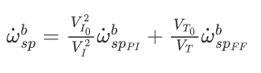

# PX4学习记录之概念续篇

## 控制器图解
这些图表使用标准 PX4 术语（每个图表都有注释图例）。
### 固定翼的控制架构

固定翼的控制分为位置环与姿态环两大部分。位置环负责控制无人机的位置与速度，姿态环负责控制无人机的姿态与角速度。
位置环也担任飞行模式的切换功能，例如从定点悬停切换到巡航飞行。

#### 位置控制

位置控制分为纵向控制与横侧向控制，纵向控制负责无人机的前进与上下高度，横侧向控制负责无人机的左右滚转与航向。


PX4的总能量控制系统 (TECS) 能够同时控制固定翼飞机的真空速和高度。该代码以实现为一个
库的形式，在固定翼位置控制模块中使用。

如上图所示，TECS 接收空速和高度设定值作为输入，并输出油门和俯仰角设定值。这两个输出被发送到实施姿态控制解决方案的固定翼姿态控制器。然而，如果油门设定点是有限的并且没有检测到发动机故障，则通过油门设定点。因此，了解 TECS 的性能直接受桨距控制环路的性能影响非常重要。空速和高度跟踪不良通常是由飞机俯仰角跟踪不良引起的。

同时控制真实空速和高度并不是一项简单的任务。增加飞机俯仰角会导致高度增加，但也会导致空速降低。增加油门会增加空速，但由于升力增加，高度也会增加。在控制领域被称作“耦合”
因此，我们有两个输入（俯仰角和油门），它们都会影响两个输出（空速和高度），这使得控制问题具有挑战性。

TECS 通过用能量而不是原始设定点来表示问题来提供解决方案。
飞机的总能量是动能和势能的总和。推力（通过油门控制）增加了飞机的总能量状态。
给定的总能量状态可以通过势能和动能的任意组合来实现。也就是说，高空低速飞行在总能量意义上可以等同于低空高空速飞行。我们将此称为特定能量平衡，它是根据当前高度和真实空速设定值计算得出的。特定能量平衡通过飞机俯仰角控制。
因此，通过将初始设定点转换为可以独立控制的能量量来**解耦**控制问题。我们使用推力来调节飞行器的特定总能量，并使用俯仰来维持势能（高度）和动能（速度）之间的特定平衡。

**总能量控制回路**

**俯仰角能量控制回路**


飞机的总能量是动能和势能的总和:
$$E_T=\frac{1}{2}mV_T^2+mgh$$
其中，m 是飞机质量，g 是重力加速度，h 是飞机高度，VT 是飞机的真实空速。
对时间求导可得出总能量率：
$$\dot{E}_T=mV_T\dot{V}_T+mg\dot{h}$$
其中，mVT˙VT 是动能率，mg˙h 是势能率。
由此，比能量率可表示为：
$$\dot E=\frac{\dot E_T}{mgV_T}=\frac{\dot V_T}{g}+\frac{\dot h}{V_T}=\frac{\dot V_T}{g}+sin(\gamma)$$
其中，γ 是飞机的飞行路径角。对于小𝛾我们可以将其近似为：
$$\dot E\approx \frac{\dot V_T}{g}+\gamma$$
从飞机的动力学方程我们得到以下关系：
$$T-D=mg(\frac{\dot V_T}{g}+sin(\gamma))\approx mg(\frac{\dot V_T}{g}+\gamma)$$
其中 T 和 D 是推力和阻力。在水平飞行中，初始推力会根据阻力进行调整，推力的变化会导致：
$$\Delta T=mg(\frac{\dot V_T}{g}+\gamma)$$
可以看出，$\Delta T$ 与比能量率$\dot E$成正比。因此，通过调节推力来控制飞机的总能量是合理的。
另一方面，舵偏控制是能量守恒的，因此用于将势能与动能交换，反之亦然。为此，特定能量平衡率定义为：
$$\dot B = \gamma - \frac{\dot V_T}{g}$$

#### 姿态控制


姿态控制器采用级联循环方法工作。外环计算姿态设定点和估计姿态之间的误差，乘以增益（P 控制器），生成速率设定点。然后，内循环计算速率误差并使用 PI（比例 + 积分）控制器生成所需的角加速度。

然后，通过控制分配（也称为混控器），使用所需的角加速度和系统的先验知识来计算控制效应器（副翼、升降舵、方向舵等）的角位置。此外，由于控制面在高速时更有效，而在低速时效率较低，因此针对巡航速度进行调整的控制器使用空速测量值进行缩放（如果使用这种传感器）。

```markdown
如果没有使用空速传感器，则禁用 FW 姿态控制器的增益调度（它是开环）；
使用空速反馈无法在 TECS 中进行任何修正。
```
前馈增益用于补偿空气动力阻尼。基本上，飞机上机身轴力矩的两个主要组成部分是由控制面（副翼、升降舵、方向舵 - 产生运动）和空气动力阻尼（与机身速率成比例 - 抵消运动）产生的。为了保持恒定的速率，可以使用速率环中的前馈来补偿该阻尼。

横滚和俯仰控制器具有相同的结构，并且假设纵向和横向动力学足够解耦以独立工作。然而，偏航控制器使用转弯协调约束生成其偏航速率设定值，以便最小化飞机滑行时产生的横向加速度。转弯协调算法仅基于协调转弯几何计算。

$$\dot \Psi_{sp}=\frac{g}{V_T}tan{\phi_{sp}}cos{\theta_{sp}}$$

偏航率控制器还有助于抵消不利的偏航效应，并通过提供额外的方向阻尼来抑制荷兰滚模式。

### Vtol的控制架构


本节简要概述垂直起降 (VTOL) 飞机的控制结构。 VTOL 飞行控制器由多旋翼控制器和固定翼控制器组成，它们可以在相应的 VTOL 模式下单独运行，也可以在转换过程中一起运行。上图展示了一个简化的控制图。请注意 VTOL 姿态控制器块，它主要促进不同 VTOL 模式的必要切换和混合逻辑，以及转换期间特定于 VTOL 类型的控制操作（例如，在向前转换期间加速标准 VTOL 的推动器电机）。该块的输入被称为“虚拟”，因为根据当前 VTOL 模式，有些输入会被控制器忽略。

对于标准和倾转旋翼 VTOL，在转换过程中，固定翼姿态控制器会产生速率设定值，然后将其馈送到单独的速率控制器中，从而产生多旋翼飞行器和固定翼执行器的扭矩命令。对于尾座，在转换过程中，多旋翼姿态控制器正在运行。

VTOL 姿态块的输出是多旋翼飞行器和固定翼执行器的单独扭矩和力命令（vehicle_torque_setpoint 和vehicle_thrust_setpoint 的两个实例）。这些是在机身特定的控制分配类中处理的。

**空速缩放**


本节的目的是借助方程解释为什么以及如何使用空速调整速率 PI 和前馈 (FF) 控制器的输出以提高控制性能。我们将首先提出滚转轴上的简化线性量纲力矩方程，然后显示空速对直接力矩产生的影响，最后显示空速在恒定滚转过程中的影响。

如上面的固定翼姿态控制器所示，速率控制器为控制分配器（此处称为“混控器”）产生角加速度设定点。为了产生这些所需的角加速度，混控器使用可用的空气动力控制面产生扭矩（例如：标准飞机通常有两个副翼、两个升降舵和一个方向舵）。这些控制面产生的扭矩很大程度上受相对空速和空气密度的影响，或者更准确地说，受动压力的影响。如果不进行空速调整，针对特定巡航空速进行严格调整的控制器将使飞机在较高空速下振荡，或者在低空速下提供较差的跟踪性能。

读者应注意真实空速 (TAS) 和指示空速 (IAS) 之间的差异，因为它们的值在非海平面飞行时有显着差异。

动压的定义为：
$$\bar q=\frac{1}{2}\rho V_T^2$$
其中 ρ 是空气密度，VT 是真实空速。
以本节其余部分的横滚轴为例，量纲横滚力矩可以写成：
$$\ell=\frac{1}{2}\rho V_T^2SbC_\ell=\bar{q}SbC_\ell$$
其中 $\ell$ 是滚动力矩，S 是参考面积，b 是机翼展长。
无量纲侧倾力矩导数 $C_\ell$  可以使用副翼能效导数$C_{\ell_{\delta_\alpha}}$,侧倾阻尼导数 $C_{\ell_p}$ 以及上反角导数$C_{\ell_\beta}$进行建模.
$$C_\ell=C_{\ell_0}+C_{\ell_\beta}\beta+C_{\ell_p}\frac{b}{2V_T}p+C_{\ell_{\delta_a}}\delta_a$$
其中 $\beta$ 是侧滑角，p 是横滚速率，$\delta_a$ 是副翼偏转角。
假设对称飞行（$\beta=0$, $C_{\ell_{0}} = 0$），仅使用侧倾率阻尼和副翼产生的侧倾力矩即可简化方程：
$$\ell=\frac{1}{2}\rho V_T^2Sb\left[C_{\ell_{\delta_a}}\delta_a+C_{\ell_p}\frac{b}{2V_T}p\right]$$

然后将这个最终方程作为接下来两个小节的基线，以确定 PI 和 FF 控制器所需的空速缩放表达式。

**静态扭矩 (PI) 缩放**

在零角速率条件下($p=0$)，阻尼项消失，并且可以使用以下公式生成恒定的瞬时扭矩：
$$\ell=\frac{1}{2}\rho V_T^2SbC_{\ell_{\delta_a}}\delta_a=\bar{q}SbC_{\ell_{\delta_a}}\delta_a$$
提取$\delta_a$，我们得到：
$$\delta_a=\frac{2bS}{C_{\ell_{\delta_a}}}\frac{1}{\rho V_T^2}\ell=\frac{bS}{C_{\ell_{\delta_a}}}\frac{1}{\bar{q}}\ell$$

其中第一个分数是恒定的，第二个分数取决于空气密度和真实空速的平方。

此外，可以证明指示空速（IAS）本质上是由空气密度调整的，因为在低高度和低速度下，IAS 可以使用简单的密度误差因子转换为 TAS

$$V_T=V_I\sqrt{\frac{\rho_0}{\rho}}$$

其中 ρ0 是海平面标准大气密度，15℃。

平方、重新排列并在两侧添加 1/2 因子就得到了动态压力$\bar q$表达式：
$$\bar{q}=\frac{1}{2}\rho V_T^2=\frac{1}{2}V_I^2\rho_0$$

现在我们可以很容易地看出动压力与 IAS 的平方成正比：
$$\bar{q}\propto V_I^2$$

之前包含 TAS 和空气密度的定标器最终可以仅使用 IAS 写入：

$$\delta_a=\frac{2bS}{C_{\ell_{\delta_a}}\rho_0}\frac{1}{V_I^2}\ell$$

**速率 (FF) 缩放**

速率控制器前馈的主要用途是补偿自然速率阻尼。再次从基线尺寸方程开始，但这一次，在匀速滚转过程中，副翼产生的扭矩应该精确补偿阻尼，例如：
$$-C_{\ell_{\delta_a}}\delta_a=C_{\ell_p}\frac{b}{2V_T}\mathrm{~p}$$
重新排列以提取理想的副翼偏转给出：
$$\delta_a=-\frac{bC_{\ell_p}}{2C_{\ell_{\delta_a}}}\frac{1}{V_T}\left.p\right.$$
第一个分数给出了理想前馈的值，我们可以看到缩放比例与 TAS 呈线性关系。请注意，负号随后被滚动阻尼导数吸收，该导数也是负的。

**结论**

速率 PI 控制器的输出必须与指示空速 (IAS) 的平方成比例，并且速率前馈 (FF) 的输出必须与真实空速 (TAS) 成比例。

$$\delta_a=\frac{V_{I_0}^2}{V_I^2}\delta_{a_{PI}}+\frac{V_{T_0}}{V_T}\delta_{a_{FF}}$$

其中 $V_{I_0}$ 和 $V_{T_0}$ 是用于调整控制器增益的参考空速。

最后，由于执行器输出已标准化，并且混合器和伺服模块被假定为线性，因此我们可以将最后一个方程重写如下：



并直接在横滚率、俯仰率和偏航率控制器中实现。

在控制性能不直接依赖于空速的机身的情况下，例如像autogyro这样的旋翼机。 可以通过FW_ARSP_SCALE_EN参数禁用空速缩放功能。

**调优建议**

这种空速缩放算法的优点在于它不需要任何特定的调整。然而，空速测量的质量直接影响其性能。

此外，为了获得最大的稳定飞行包线，应将姿态控制器调整到以失速速度和飞行器最大空速为中心的空速值（例如：可以在15到25m/s之间飞行的飞机应调整为20m/s）。应在 FW_AIRSPD_TRIM 参数中设置此“调整”空速。


#### VTOL飞控软件拓扑图
